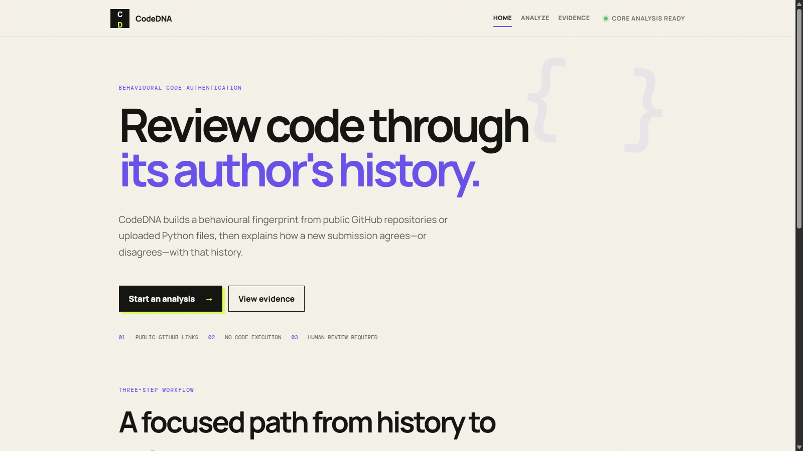
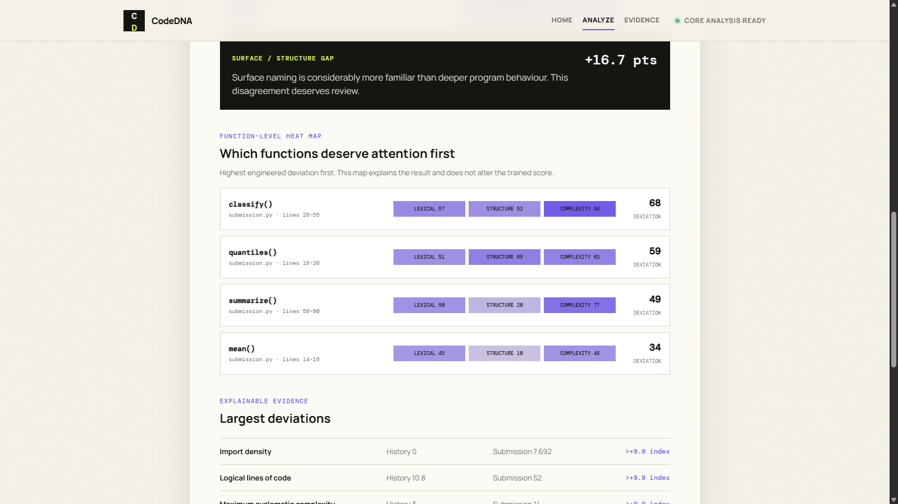
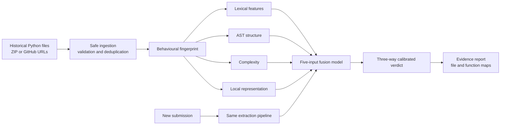
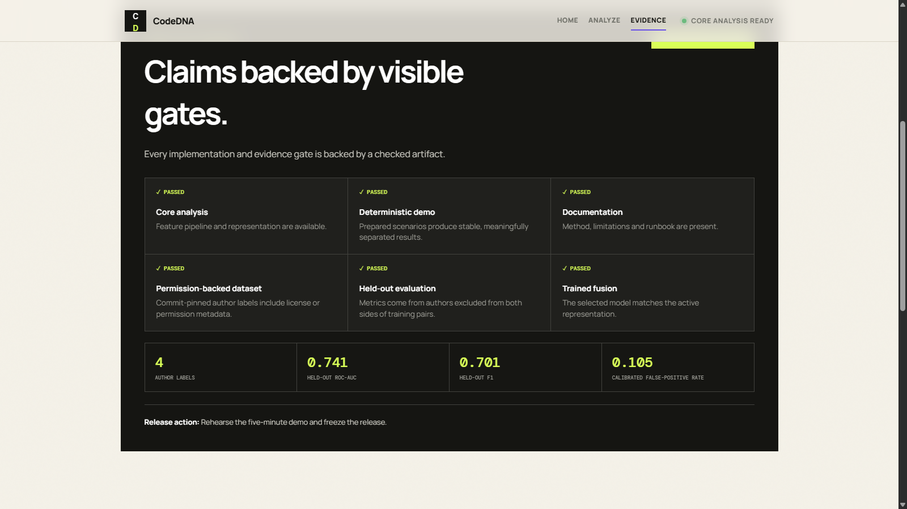

# CodeDNA — Code Authenticity Checker

> Behavioural code-consistency review for Python submissions, backed by explainable evidence and held-out evaluation.

[Live demo](https://referenced-chatgpt-conversation-thi-pearl-xi.vercel.app) · [Demo video](https://drive.google.com/file/d/1RX47Q3UCF8WWkt42jT_8-v3--E2KbsiR/view) · [Implementation plan](outputs/CodeDNA_PS02_24-Hour_Implementation_Plan.md)



## The problem

A sudden change in a submission's sophistication or structure deserves review, but it does not prove AI use or misconduct. CodeDNA compares new Python code with the developer's own historical work and shows exactly where measurable behaviour changed.

CodeDNA is a **review-support system**. Its output must be combined with code history, task context, and the developer's explanation.

## What it does

- Builds a behavioural fingerprint from at least ten historical Python files.
- Accepts individual files, bounded ZIP archives, or up to four public GitHub repository URLs.
- Scans public repositories through commit-pinned GitHub trees without cloning the complete repository.
- Extracts lexical habits, AST structure, complexity, and a local AST-token representation.
- Combines five comparison signals with a trained logistic fusion model selected against a custom neural challenger.
- Produces **Consistent**, **Uncertain**, or **Review Recommended** outcomes.
- Explains results with component scores, ranked deviations, file-level triage, and a function-level heat map.
- Exports evidence JSON and a standalone printable HTML review report without submitted source code.



## Architecture



## Evaluation evidence

The checked public benchmark uses a leakage-aware grouped split: each held-out author label is excluded from both sides of every training pair.

| Measure | Result |
|---|---:|
| Distinct evaluation files | 247 |
| Repository-owner proxy labels | 4 |
| Held-out ROC-AUC | 0.741 |
| Held-out F1 at the fixed 0.50 comparison threshold | 0.701 |
| Deployed calibrated false-positive rate | 0.105 |
| Strict-threshold recall | 0.329 |
| Outcomes routed to Uncertain | 61.2% |

The lower deployed false-positive rate comes from abstaining on overlapping cases. It does not improve the underlying ROC-AUC, and the resulting uncertainty rate is intentionally reported rather than hidden. See [EVALUATION.md](EVALUATION.md) and [MODEL_CARD.md](MODEL_CARD.md).



## Run locally

Requirements: Python 3.11 or newer.

```powershell
.\start.ps1
```

Open <http://127.0.0.1:8000/>.

The product is split into focused pages:

- `/` — product overview;
- `/analyze.html` — fingerprint and submission review;
- `/evidence.html` — readiness, evaluation, methodology, and limitations.

## Test

```powershell
python -m unittest discover -s tests -v
python -m codedna.readiness
```

The repository currently contains 47 automated tests, including feature extraction, ingestion safety, profile construction, scoring, serverless profile handoff, API routes, model training, held-out evaluation, and evidence generation.

## API

| Method | Route | Purpose |
|---|---|---|
| `GET` | `/api/health` | Runtime and representation readiness |
| `GET` | `/api/model` | Active model and evaluation provenance |
| `GET` | `/api/readiness` | Competition evidence gates |
| `GET` | `/api/demo/{consistent|review|mixed}` | Deterministic scenarios through the real pipeline |
| `POST` | `/api/profiles` | Build a behavioural profile |
| `POST` | `/api/profiles/{id}/analyze` | Analyze a new submission |

The deployed browser carries only derived profile statistics between serverless requests. Historical source files are not returned to the client.

## Train and reproduce evidence

Create one directory per attributable author label, with at least six distinct Python files per author, then run:

```powershell
python -m codedna.collect DATA_MANIFEST_TEMPLATE.csv --dataset work/dataset --manifest work/evaluation/resolved_sources.csv
python -m codedna.evidence work/dataset --output work/evaluation
```

The evidence build audits inputs, checks cross-author duplicates, performs author-held-out model selection, calibrates the three-way verdict, writes charts and per-fold metrics, and records SHA-256 checksums.

## Repository layout

```text
api/                  Vercel serverless adapter
codedna/              Analysis, ingestion, model, and evidence modules
frontend/             Multi-page browser interface
docs/images/          README screenshots
tests/                Automated regression suite
work/evaluation/      Checked machine-readable results
outputs/              Implementation and submission documents
```

## Limitations

- Python only.
- Public evaluation labels are repository-owner proxies, not verified file-level authorship.
- Four labels are insufficient for institutional validation or subgroup conclusions.
- The active representation is a local AST-token vector; optional frozen CodeBERT support requires a separate benchmark before activation.
- Learning, collaboration, frameworks, refactoring, and task changes can legitimately alter style.
- The Vercel deployment has platform request-size and execution-time limits; large ZIP analysis is best run locally.

## Responsible-use boundary

A low score means **behavioural deviation**, not its cause. CodeDNA must not be used as the sole basis for allegations, grading penalties, or disciplinary action.

## License and data

The application code is provided for hackathon demonstration. External evaluation sources retain their original licenses and are recorded with immutable commit SHAs in `work/evaluation/resolved_sources.csv`. Datasets, caches, generated videos, and downloaded model weights are excluded from Git.

